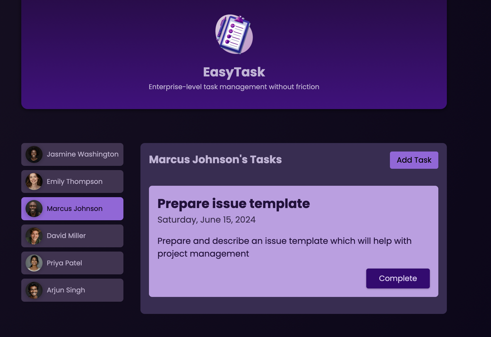

# Easy Task App

## <u>Author</u>: Zev Rosenbaum <u>Created</u>: February 2025

<u>**Description</u>:** 

Project from the first two sections of the [Angular - The Complete Guide](https://www.udemy.com/course/the-complete-guide-to-angular-2/?couponCode=KEEPLEARNING) course.
<ul>
<li>To run - just like any angular project - run <code>npm run start</code> in the root directory of this project.</li>
</ul>

<u>**User Interface</u>:** 

